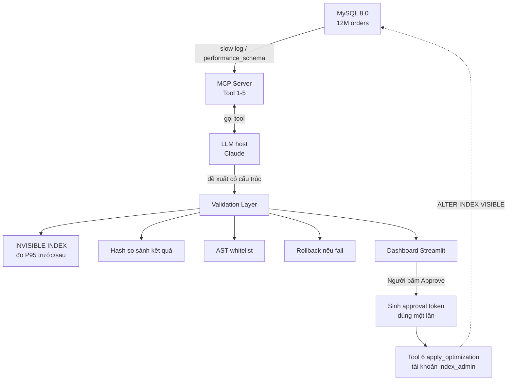

# 🚀 MCP Slow Query Optimizer

> **Dự án môn học:** Tối ưu Slow Query và Chỉ mục CSDL bằng LLM thông qua kiến trúc MCP (Model Context Protocol).

---

## 📖 Dự án này làm gì?

Hệ thống hỗ trợ **tìm và đề xuất cách sửa các câu truy vấn MySQL chậm** bằng LLM, với con người quyết định cuối cùng:

1. **Đọc** slow query log / `performance_schema` → tìm query chạy > 0.5s
2. **Phân tích** bằng LLM (Claude) qua các tool MCP: schema, thống kê dữ liệu, EXPLAIN
3. **Đề xuất** dạng có cấu trúc: thêm index, hoặc viết lại query
4. **Kiểm chứng tự động** bằng INVISIBLE INDEX: đo P95 trước/sau, so sánh kết quả có tương đương không, tự rollback nếu kém
5. **Con người duyệt** trên Dashboard → hệ thống sinh **approval token dùng một lần** → mới áp dụng thật

> **Lưu ý:** LLM chỉ **đề xuất**. LLM không có quyền tự áp dụng thay đổi và không thấy tool `apply_optimization`. Đề xuất _viết lại query_ chỉ để hiển thị, không tự áp dụng vào DB.

### 🎬 Case study: Sự cố Black Friday

Một sàn TMĐT có **12 triệu đơn hàng**, một query báo cáo doanh thu lọc theo `created_at` và `status` thiếu composite index phù hợp → **full table scan 12M dòng**, CPU database lên **98%**, sập cổng thanh toán.

Nhóm sẽ **kiểm chứng bằng số liệu thật** thứ tự cột tối ưu (`(created_at, status)` hay `(status, created_at)`) thay vì mặc định theo đề bài.

---

## 🏗️ Kiến trúc tổng thể



**Lớp bảo mật:** `readonly_user` cho tool phân tích → sanitize dữ liệu đưa vào LLM → AST whitelist (fail-closed) → approval token → tài khoản `index_admin` chỉ có `CREATE/DROP INDEX` → audit log.

### 6 Tool của MCP Server

|  #  | Tool                 | Chức năng                                                 |      LLM gọi được?       |
| :-: | -------------------- | --------------------------------------------------------- | :----------------------: |
|  1  | `get_slow_queries`   | Top N query chậm (digest, latency, rows examined)         |            ✅            |
|  2  | `get_schema`         | Cấu trúc bảng + index hiện có                             |            ✅            |
|  3  | `get_table_stats`    | Số dòng, cardinality, phân bố giá trị                     |            ✅            |
|  4  | `explain_query`      | `EXPLAIN FORMAT=JSON` / `EXPLAIN ANALYZE`                 |            ✅            |
|  5  | `benchmark_query`    | Đo P50/P95, hash kết quả                                  |            ✅            |
|  6  | `apply_optimization` | ⚠️ Áp dụng thật, **cần approval token** do Dashboard sinh | ❌ Chỉ backend Dashboard |

> Input/output chi tiết: [docs/api-contract.md](docs/api-contract.md)

---

## 👥 Thành viên & Vai trò

| Thành viên | Vai trò                      | Phụ trách chính                                            |
| ---------- | ---------------------------- | ---------------------------------------------------------- |
| **Vũ**     | 🧠 Team Lead + MCP Architect | Điều phối, `server.py`, Tool 1–3, tích hợp LLM, báo cáo    |
| **Hải**    | 🗄️ DB Engineer + Validation  | CSDL 12M, Tool 4, Validation Layer + rollback              |
| **Tình**   | 🛡️ Security + Frontend       | AST whitelist, Tool 6 + token, 20 injection, Dashboard     |
| **Tường**  | 📊 Data Analyst + Metrics    | 30 query, ground truth, Tool 5, metrics, baseline, biểu đồ |

> 📖 Chi tiết: [project-management/TEAM.md](project-management/TEAM.md)

---

## 📊 Tiến độ hiện tại

| Giai đoạn                              |   Trạng thái    |
| -------------------------------------- | :-------------: |
| Setup môi trường                       |     ✅ Done     |
| Chốt thiết kế (contract, architecture) |   🟡 Đang làm   |
| CSDL 12M records                       |   🟡 Đang làm   |
| 30 query + ground truth                |   🟡 Đang làm   |
| Tool 1–6 MCP                           | ⬜ Chưa bắt đầu |
| Validation Layer                       | ⬜ Chưa bắt đầu |
| 20 Prompt Injection                    | ⬜ Chưa bắt đầu |
| Dashboard                              | ⬜ Chưa bắt đầu |
| Báo cáo + Demo                         | ⬜ Chưa bắt đầu |

**Chú thích:** ✅ Done | 🟡 Đang làm | ⬜ Chưa làm | 🔴 Trễ hạn

> 📖 Chi tiết: [project-management/PROGRESS.md](project-management/PROGRESS.md) · Lịch và deadline: [project-management/ROADMAP.md](project-management/ROADMAP.md)

---

## 🚀 Cài đặt & Chạy

### Yêu cầu

- Python 3.11+
- Docker Desktop
- Git
- MySQL 8.0 (qua Docker) — cần 8.0 để dùng INVISIBLE INDEX
- (Tùy chọn) Percona Toolkit để chạy `pt-query-digest`

### Các bước

```bash
# 1. Clone repo
git clone https://github.com/lam-vu6868/mcp-slowquery-optimizer.git
cd mcp-slowquery-optimizer

# 2. Tạo môi trường ảo
python -m venv .venv
source .venv/bin/activate    # Mac/Linux
.venv\Scripts\activate       # Windows

# 3. Cài thư viện
pip install -r requirements.txt

# 4. Cấu hình môi trường
cp .env.example .env
# Sửa .env: API key Anthropic, mật khẩu DB (readonly_user, index_admin), APPROVAL_SECRET
# ⚠️ Không commit file .env

# 5. Khởi động MySQL
docker compose up -d

# 6. Seed dữ liệu
#    12M orders + 20M order_items: ước tính 2–6 giờ tùy máy (chạy nền/qua đêm).
#    Nếu máy yếu: SEED_SCALE=5m để giảm còn 5M orders (vẫn đạt yêu cầu tối thiểu của đề).
python data/seed/seed_all.py

# 7. Chạy MCP Server
python -m mcp_server.server

# 8. Chạy Dashboard (terminal khác)
streamlit run dashboard/app.py
```

---

## 📁 Cấu trúc thư mục

```
mcp-slowquery-optimizer/
├── project-management/  # 📊 Quản lý dự án
│   ├── ROADMAP.md       #    ⭐ Nguồn sự thật: lịch, deadline, quyết định kỹ thuật
│   ├── TEAM.md          #    Ai làm gì, ai review file nào
│   ├── PROGRESS.md      #    Trạng thái hiện tại
│   ├── CONTRIBUTING.md
│   └── GIT-WORKFLOW.md
│
├── mcp_server/          # ⭐ MCP Server + tool + LLM + validation
│   ├── server.py
│   ├── tools/           #    6 tool (Vũ: 1–3 · Hải: 4 · Tường: 5 · Tình: 6)
│   ├── llm/             #    Agent, prompt, parser (Vũ)
│   ├── validation/      #    Validation Layer (Hải)
│   └── utils/
├── db/                  # 🗄️ Schema + MySQL config          (Hải)
├── data/
│   ├── seed/            #    Script seed                      (Hải)
│   ├── queries/         #    30 query + ground_truth.json     (Tường)
│   ├── metrics/         #    Metrics, comparison.csv, charts  (Tường)
│   └── baseline/        #    greedy, rule-based, pt-query-digest (Tường)
├── security/            # 🛡️ AST whitelist, approval token, 20 injection (Tình)
├── dashboard/           # 🖥️ Streamlit 4 tab                 (Tình)
├── tests/               # 🧪 Unit tests                      (Cả nhóm)
├── docs/                # 📚 api-contract, architecture, handover (Vũ)
├── reports/             # 📝 Báo cáo + slide                 (Vũ)
├── scripts/             # 🔧 Script setup
├── .github/CODEOWNERS   # 🔒 Quy tắc review theo thư mục
└── README.md
```

---

## 🧪 Testing

```bash
pytest tests/ -v

pytest tests/test_ast_whitelist.py -v     # quy tắc AST, bypass phổ biến
pytest tests/test_approval_token.py -v    # token sai/hết hạn/dùng lại
pytest tests/test_validation.py -v        # rollback, hash kết quả
pytest security/injection_tests/ -v       # 20 kịch bản injection
```

---

## 📏 Chỉ số đánh giá (tóm tắt)

Định nghĩa đầy đủ và ngưỡng mục tiêu: [ROADMAP.md](project-management/ROADMAP.md) mục 2.4.

- **Precision / Recall (index)** so với ground truth dạng _tập đáp án chấp nhận được_ (khớp chính xác hoặc tương đương về hiệu năng)
- **Consistency Rate:** chạy lại 5 lần cùng prompt, cố định model + temperature thấp
- **False Positive Rate:** index thừa/trùng lặp
- **Metric rewrite:** kết quả tương đương (hash) + P95 giảm ≥ 20%
- **Trade-off ghi/đọc:** dung lượng index + INSERT throughput trước/sau
- **Baseline:** greedy + rule-based (đề xuất index); `pt-query-digest` (phát hiện query chậm)

---

## 🛡️ Bảo mật

Kiểm thử **20 kịch bản** prompt injection chia 4 kênh (slow log, schema comment, cấu trúc SQL, đầu ra/mã hóa). Báo cáo kết quả theo dạng _"chặn được các kịch bản đã thử ở các lớp X, Y, Z"_ kèm phần giới hạn, không tuyên bố an toàn tuyệt đối. Chi tiết: `security/injection_report.md`.

---

## 📚 Tài liệu liên quan

| File                                                                     | Mô tả                                                        |
| ------------------------------------------------------------------------ | ------------------------------------------------------------ |
| [project-management/ROADMAP.md](project-management/ROADMAP.md)           | ⭐ Lịch, deadline, quyết định kỹ thuật, định nghĩa metric    |
| [project-management/TEAM.md](project-management/TEAM.md)                 | Phân công, quy tắc review                                    |
| [project-management/PROGRESS.md](project-management/PROGRESS.md)         | Tiến độ hiện tại                                             |
| [project-management/CONTRIBUTING.md](project-management/CONTRIBUTING.md) | Git flow, commit                                             |
| [project-management/GIT-WORKFLOW.md](project-management/GIT-WORKFLOW.md) | Hướng dẫn Git                                                |
| [docs/api-contract.md](docs/api-contract.md)                             | Input/output 6 tool                                          |
| [docs/architecture.md](docs/architecture.md)                             | Kiến trúc chi tiết (MCP host/client, luồng Dashboard → tool) |
| [docs/setup-guide.md](docs/setup-guide.md)                               | Hướng dẫn cài đặt từ A–Z                                     |

---

## 📞 Liên hệ

- **Nhóm trưởng:** Lý Lâm Vũ — 23050102@student.bdu.edu.vn
- **GVHD:** Dương Quang Sinh — dqsinh@bdu.edu.vn
