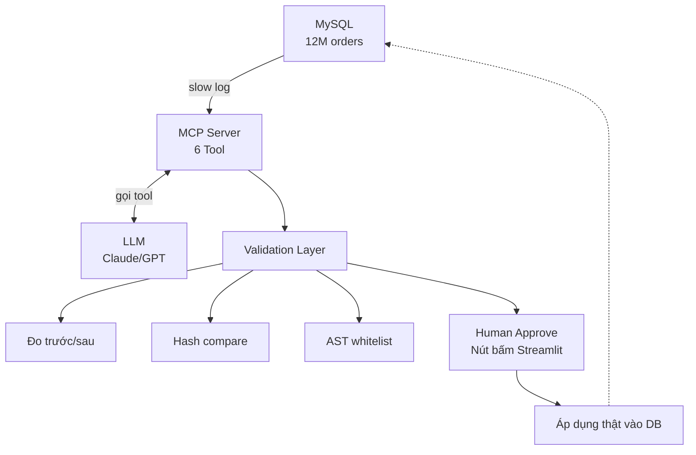

# 🚀 MCP Slow Query Optimizer

> **Đề tài tốt nghiệp:** Tối ưu Slow Query và Chỉ mục CSDL bằng LLM thông qua kiến trúc MCP (Model Context Protocol).

---

## 📖 Dự án này làm gì? (Đọc 30 giây là hiểu)

Hệ thống **tự động tìm và sửa các câu truy vấn CSDL chậm** bằng AI:

1. **Đọc** slow query log của MySQL → tìm ra câu query chạy > 0.5s
2. **Phân tích** bằng LLM (Claude/GPT) → hiểu tại sao chậm
3. **Đề xuất** giải pháp: thêm index hoặc viết lại query
4. **Kiểm chứng** tự động: chạy thử trước/sau, so sánh kết quả
5. **Con người duyệt** trên Dashboard → mới áp dụng thật

### 🎬 Case study: Sự cố Black Friday

Một sàn TMĐT có **12 triệu đơn hàng**, thiếu composite index trên `(created_at, status)`. Một query báo cáo doanh thu khiến MySQL **full table scan 12M dòng**, đẩy CPU lên **98%**, sập luôn cổng thanh toán.

Hệ thống của chúng ta sẽ **tự phát hiện và đề xuất sửa** trước khi sự cố xảy ra.

---

## 🏗️ Kiến trúc tổng thể



### 6 Tool của MCP Server

|  #  | Tool                 | Chức năng                                   |
| :-: | -------------------- | ------------------------------------------- |
|  1  | `get_slow_queries`   | Đọc `mysql.slow_log`, trả top N query chậm  |
|  2  | `get_schema`         | Trả cấu trúc bảng (cột + index hiện có)     |
|  3  | `get_table_stats`    | Số dòng, cardinality, phân bố dữ liệu       |
|  4  | `explain_query`      | Chạy `EXPLAIN FORMAT=JSON`                  |
|  5  | `benchmark_query`    | Đo P50/P95 latency                          |
|  6  | `apply_optimization` | ⚠️ Áp dụng thật — **yêu cầu approved=True** |

---

## 👥 Thành viên & Vai trò

| Thành viên | Vai trò                      | Phụ trách chính                                    |
| ---------- | ---------------------------- | -------------------------------------------------- |
| **Vũ**     | 🧠 Team Lead + MCP Architect | Điều phối, MCP Server core, tích hợp LLM, báo cáo  |
| **Hải**    | 🗄️ DB Engineer + Backend     | CSDL 12M records, 6 tool backend, Validation Layer |
| **Tình**   | 🛡️ Security + Frontend       | AST whitelist, 20 injection test, Dashboard        |
| **Tường**  | 📊 Data Analyst + Metrics    | Ground truth, đo metrics, biểu đồ                  |

> 📖 Xem chi tiết phân công tại [project-management/TEAM.md](project-management/TEAM.md)

---

## 📊 Tiến độ hiện tại

| Giai đoạn           |   Trạng thái    |
| ------------------- | :-------------: |
| Setup môi trường    |     ✅ Done     |
| CSDL 12M records    |   🟡 Đang làm   |
| 6 Tool MCP          | ⬜ Chưa bắt đầu |
| Validation Layer    | ⬜ Chưa bắt đầu |
| 20 Prompt Injection | ⬜ Chưa bắt đầu |
| Dashboard           | ⬜ Chưa bắt đầu |
| Báo cáo + Demo      | ⬜ Chưa bắt đầu |

**Chú thích:** ✅ Done | 🟡 Đang làm | ⬜ Chưa làm | 🔴 Trễ hạn

> 📖 Xem chi tiết tiến độ tại [project-management/PROGRESS.md](project-management/PROGRESS.md)

---

## 🚀 Cài đặt & Chạy

### Yêu cầu

- Python 3.11+
- Docker Desktop
- Git

### Các bước

```bash
# 1. Clone repo
git clone https://github.com/lam-vu6868/mcp-slowquery-optimizer.git
cd mcp-slowquery-optimizer

# 2. Tạo môi trường ảo
python -m venv .venv
source .venv/bin/activate    # Mac/Linux
.venv\Scripts\activate       # Windows

# 3. Cài thư viện
pip install -r requirements.txt

# 4. Cấu hình môi trường
cp .env.example .env
# Sửa .env: điền API key Anthropic + mật khẩu DB

# 5. Khởi động MySQL
docker compose up -d

# 6. Seed dữ liệu (12M records ~30 phút)
python data/seed/seed_all.py

# 7. Chạy MCP Server
python -m mcp_server.server

# 8. Chạy Dashboard (mở terminal khác)
streamlit run dashboard/app.py
```

---

## 📁 Cấu trúc thư mục

```
mcp-slowquery-optimizer/
├── project-management/  # 📊 Quản lý dự án
│   ├── PROGRESS.md      #    Tiến độ theo tuần
│   ├── TEAM.md          #    Phân công 4 thành viên
│   ├── ROADMAP.md       #    Lộ trình 12 tuần
│   ├── CONTRIBUTING.md  #    Quy định contribute
│   └── GIT-WORKFLOW.md  #    Hướng dẫn Git cho nhóm
│
├── mcp_server/          # ⭐ MCP Server + 6 tool      (Vũ + Hải)
├── db/                  # 🗄️ Schema + MySQL config    (Hải)
├── data/                # 📊 Seed data + queries      (Hải + Tường)
├── security/            # 🛡️ AST + 20 injection       (Tình)
├── dashboard/           # 🖥️ Streamlit 4 tab          (Tình)
├── tests/               # 🧪 Unit tests               (Cả nhóm)
├── docs/                # 📚 Tài liệu kỹ thuật        (Vũ)
├── reports/             # 📝 Báo cáo + slide          (Vũ)
├── scripts/             # 🔧 Script setup             (Vũ)
└── README.md            # 📄 File này
```

---

## 🧪 Testing

```bash
# Chạy toàn bộ test
pytest tests/ -v

# Test riêng từng module
pytest tests/test_ast_whitelist.py -v
pytest tests/test_validation.py -v
```

---

## 📚 Tài liệu liên quan

| File                                                                     | Mô tả                      |
| ------------------------------------------------------------------------ | -------------------------- |
| [project-management/PROGRESS.md](project-management/PROGRESS.md)         | Tiến độ chi tiết theo tuần |
| [project-management/TEAM.md](project-management/TEAM.md)                 | Phân công 4 thành viên     |
| [project-management/ROADMAP.md](project-management/ROADMAP.md)           | Lộ trình 12 tuần           |
| [project-management/CONTRIBUTING.md](project-management/CONTRIBUTING.md) | Quy định Git flow, commit  |
| [project-management/GIT-WORKFLOW.md](project-management/GIT-WORKFLOW.md) | Hướng dẫn Git chi tiết     |
| [docs/architecture.md](docs/architecture.md)                             | Kiến trúc chi tiết         |
| [docs/api-contract.md](docs/api-contract.md)                             | Input/output 6 tool        |
| [docs/setup-guide.md](docs/setup-guide.md)                               | Hướng dẫn cài đặt từ A-Z   |

---

## 📞 Liên hệ

- **Nhóm trưởng:** Lý Lâm Vũ — 23050102@student.bdu.edu.vn
- **GVHD:** Dương Quang Sinh — dqsinh@bdu.edu.vn
