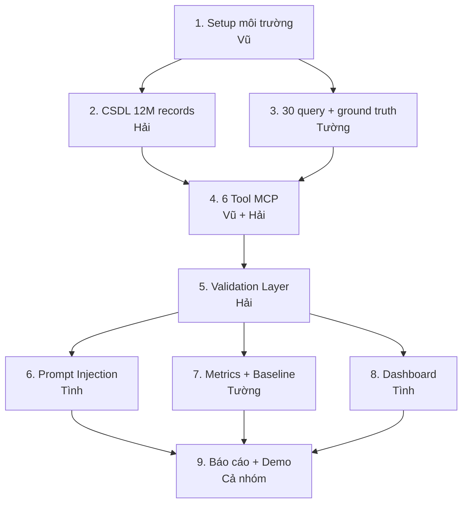
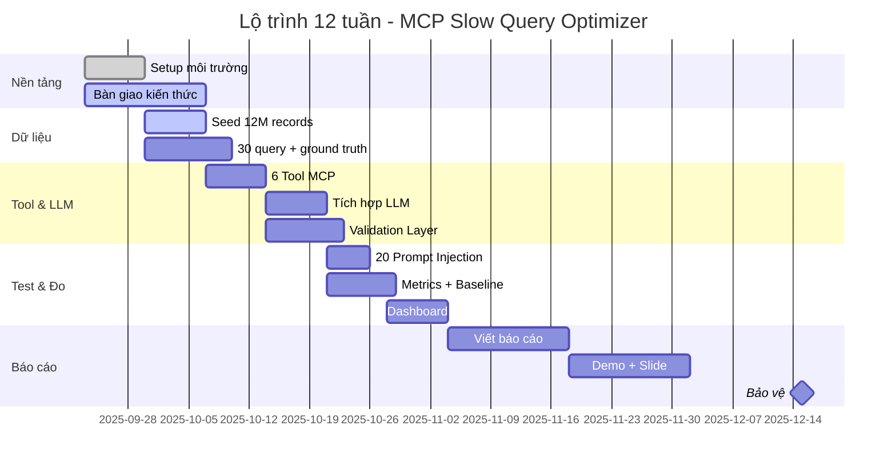

# 🗺️ LỘ TRÌNH THỰC HIỆN

> **Đọc file này để biết:** Hôm nay làm gì tiếp, tại sao phải làm phần này trước phần kia.
> **Người cập nhật:** Vũ (nhóm trưởng)

---

## 🔗 SƠ ĐỒ PHỤ THUỘC (CÁI GÌ PHẢI XONG TRƯỚC)

**Đọc sơ đồ:** Mũi tên = "phải xong trước". Ví dụ: **không thể** làm Validation Layer (5) nếu chưa có 6 Tool MCP (4).

---

## 📅 THỨ TỰ LÀM CHI TIẾT (12 TUẦN)

### 🟢 TUẦN 1 — NỀN TẢNG (23/09 → 29/09)

**Mục tiêu:** Mọi thứ chạy được ở mức cơ bản

| Thứ tự | Việc                                    | Ai làm  | Mất bao lâu |
| :----: | --------------------------------------- | ------- | ----------- |
|   1    | Vũ tạo repo + push cấu trúc lên GitHub  | Vũ      | 2h          |
|   2    | Hải cấu hình MySQL trong Docker         | Hải     | 3h          |
|   3    | Hải tạo user readonly + bật slow log    | Hải     | 1h          |
|   4    | Tình test quyền readonly                | Tình    | 2h          |
|   5    | Tường draft 30 query (chưa cần chạy)    | Tường   | 4h          |
|   6    | Tình setup Streamlit skeleton           | Tình    | 3h          |
|   7    | Cả nhóm họp chốt `docs/api-contract.md` | Cả nhóm | 2h          |
|   8    | **Bàn giao kiến thức** (4 buổi)         | Cả nhóm | 12h         |

**✅ Tiêu chí Done tuần 1:**

- [ ] `docker compose up -d` chạy không lỗi
- [ ] `SHOW VARIABLES LIKE 'slow_query_log'` → ON
- [ ] `readonly_user` không thể chạy `DROP TABLE`
- [ ] Streamlit `app.py` mở được trên browser
- [ ] Draft 30 query (đủ 5 nhóm)
- [ ] `docs/api-contract.md` đã chốt
- [ ] Bàn giao xong MCP / MySQL / Security / Metrics

---

### 🟢 TUẦN 2 — DỮ LIỆU (30/09 → 06/10)

**Mục tiêu:** CSDL có 12M orders, 30 query draft xong

| Thứ tự | Việc                            | Ai làm | Mất bao lâu    |
| :----: | ------------------------------- | ------ | -------------- |
|   1    | Hải viết `seed_users.py` (1M)   | Hải    | 3h             |
|   2    | Hải viết `seed_orders.py` (12M) | Hải    | 4h             |
|   3    | Hải chạy seed qua đêm           | Hải    | ~6h (chạy nền) |
|   4    | Tường verify phân bố dữ liệu    | Tường  | 2h             |
|   5    | Tường hoàn thành 30 query       | Tường  | 6h             |
|   6    | Vũ viết khung 6 tool rỗng       | Vũ     | 4h             |
|   7    | Tình draft AST whitelist        | Tình   | 4h             |

**✅ Tiêu chí Done tuần 2:**

- [ ] `SELECT COUNT(*) FROM orders` ≥ 5,000,000
- [ ] Slow log có ≥ 10 query
- [ ] 30 query trong `queries.py` chạy được
- [ ] 6 file tool tồn tại trong `mcp_server/tools/`

**⚠️ Lưu ý:** Nếu seed 12M mất quá lâu → giảm còn 5M (vẫn đủ yêu cầu tối thiểu).

---

### 🟡 TUẦN 3 — TOOL MCP (07/10 → 13/10)

**Mục tiêu:** 3 tool core chạy được, ground truth có chữ ký

| Thứ tự | Việc                                       | Ai làm |
| :----: | ------------------------------------------ | ------ |
|   1    | Vũ code `get_slow_queries`                 | Vũ     |
|   2    | Vũ code `get_schema`                       | Vũ     |
|   3    | Vũ code `get_table_stats`                  | Vũ     |
|   4    | Hải code `explain_query`                   | Hải    |
|   5    | Hải code `benchmark_query`                 | Hải    |
|   6    | Tường đo phân bố + ghi `ground_truth.json` | Tường  |
|   7    | Tường xin chữ ký GVHD trên ground truth    | Tường  |
|   8    | Tình test AST với payload đơn giản         | Tình   |

**✅ Tiêu chí Done tuần 3:**

- [ ] Gọi `get_slow_queries()` → JSON đúng
- [ ] Gọi `explain_query(sql)` → JSON EXPLAIN
- [ ] `ground_truth.json` có **chữ ký GVHD** ⚠️ bắt buộc

---

### 🟡 TUẦN 4 — LLM + VALIDATION (14/10 → 20/10)

**Mục tiêu:** LLM gọi tool được, Validation rollback được

| Thứ tự | Việc                                       | Ai làm |
| :----: | ------------------------------------------ | ------ |
|   1    | Vũ đăng ký API key Anthropic               | Vũ     |
|   2    | Vũ code `agent.py` gọi Claude              | Vũ     |
|   3    | Vũ viết system prompt ép JSON              | Vũ     |
|   4    | Hải xây Validation Layer (đo trước/sau)    | Hải    |
|   5    | Hải code rollback khi fail                 | Hải    |
|   6    | Tường viết hash compare                    | Tường  |
|   7    | Tình test 20 injection đầy đủ              | Tình   |
|   8    | Tình code `apply_optimization` + AST check | Tình   |

**✅ Tiêu chí Done tuần 4:**

- [ ] LLM trả JSON hợp lệ 100%
- [ ] Validation tự rollback khi đề xuất kém
- [ ] 20/20 injection bị chặn

---

### 🟡 TUẦN 5 — METRICS (21/10 → 27/10)

**Mục tiêu:** Có số liệu Precision/Recall

| Thứ tự | Việc                                | Ai làm |
| :----: | ----------------------------------- | ------ |
|   1    | Tường chạy 30 query qua LLM         | Tường  |
|   2    | Tường so sánh với ground truth      | Tường  |
|   3    | Tường tính Precision/Recall         | Tường  |
|   4    | Tường tính Consistency Rate (5 lần) | Tường  |
|   5    | Tường tính FPR                      | Tường  |
|   6    | Vũ prompt engineering cải thiện     | Vũ     |
|   7    | Hải đo trade-off index size         | Hải    |
|   8    | Tình hoàn thiện injection report    | Tình   |

**✅ Tiêu chí Done tuần 5:**

- [ ] Precision ≥ 60%, Recall ≥ 60%
- [ ] Consistency Rate ≥ 70%
- [ ] File `comparison.csv` có số liệu

---

### 🟡 TUẦN 6 — BASELINE + DASHBOARD (28/10 → 03/11)

**Mục tiêu:** Có so sánh với pt-query-digest, Dashboard 4 tab

| Thứ tự | Việc                                  | Ai làm |
| :----: | ------------------------------------- | ------ |
|   1    | Hải chạy `pt-query-digest`            | Hải    |
|   2    | Hải so sánh LLM vs baseline           | Hải    |
|   3    | Tường vẽ biểu đồ matplotlib           | Tường  |
|   4    | Tình làm Dashboard tab 1 (Slow query) | Tình   |
|   5    | Tình làm tab 2 (Đề xuất LLM)          | Tình   |
|   6    | Tình làm tab 3 (Trước/sau)            | Tình   |
|   7    | Tình làm tab 4 (Security)             | Tình   |
|   8    | Vũ review code toàn bộ                | Vũ     |

**✅ Tiêu chí Done tuần 6:**

- [ ] `comparison.csv` có 3 dòng (LLM, pt-query-digest, greedy)
- [ ] Dashboard 4 tab chạy được
- [ ] Nút Approve gọi được `apply_optimization`

---

### 🟢 TUẦN 7–8 — BÁO CÁO (04/11 → 17/11)

**Mục tiêu:** Viết xong các chương báo cáo

| Thứ tự | Việc                                          | Ai làm |
| :----: | --------------------------------------------- | ------ |
|   1    | Vũ viết chương 1-3 (Mở đầu, Cơ sở, Kiến trúc) | Vũ     |
|   2    | Hải viết chương "Cài đặt"                     | Hải    |
|   3    | Tường viết chương "Thực nghiệm"               | Tường  |
|   4    | Tình viết chương "Bảo mật"                    | Tình   |
|   5    | Vũ review + format toàn bộ                    | Vũ     |

---

### 🟢 TUẦN 9–10 — DEMO (18/11 → 01/12)

**Mục tiêu:** Video demo + slide hoàn chỉnh

| Thứ tự | Việc                           | Ai làm              |
| :----: | ------------------------------ | ------------------- |
|   1    | Tình quay video demo 5-10 phút | Tình                |
|   2    | Vũ làm slide 15-20 trang       | Vũ                  |
|   3    | Cả nhóm diễn tập               | Cả nhóm             |
|   4    | Chuẩn bị Q&A                   | Mỗi người phần mình |
|   5    | Test demo 3 lần liên tục       | Cả nhóm             |

---

### 🏁 TUẦN 11–12 — BẢO VỆ (02/12 → 15/12)

**Mục tiêu:** Bảo vệ thành công

| Việc                           | Ai làm  |
| ------------------------------ | ------- |
| Nộp báo cáo + slide cho GVHD   | Vũ      |
| Backup toàn bộ source code     | Hải     |
| In báo cáo bìa cứng (3 bản)    | Tường   |
| Test máy demo tại phòng bảo vệ | Tình    |
| **BẢO VỆ TRƯỚC HỘI ĐỒNG**      | Cả nhóm |

---

## 🎯 5 NGUYÊN TẮC LÀM VIỆC

1. **Làm từ gốc lên** — CSDL trước, rồi mới tới tool, rồi mới tới LLM
2. **Test sớm, test thường xuyên** — không để tuần cuối mới test
3. **Cái gì khó làm trước** — LLM integration khó → đừng để tuần 11
4. **Có backup cho mọi thứ** — video demo, source code, data
5. **Chốt trước khi code** — `api-contract.md` phải xong trước khi viết tool

---

## ⚠️ CÁI GÌ PHẢI XONG TRƯỚC CÁI GÌ (CHECKLIST)

**Trước khi bắt đầu Validation Layer, phải có:**

- [ ] 6 Tool MCP chạy được
- [ ] LLM gọi được ít nhất 3 tool
- [ ] Có ít nhất 5 query chậm để test

**Trước khi bắt đầu Metrics, phải có:**

- [ ] Ground truth có chữ ký GVHD
- [ ] LLM đề xuất được index cho 30 query
- [ ] Validation Layer chạy được

**Trước khi bắt đầu Dashboard, phải có:**

- [ ] 6 tool MCP trả JSON ổn định
- [ ] Validation Layer trả kết quả
- [ ] Có dữ liệu thật để hiển thị

**Trước khi viết báo cáo, phải có:**

- [ ] Tất cả số liệu metrics
- [ ] Biểu đồ
- [ ] 20/20 injection pass

---

## 🔥 NẾU TRỄ DEADLINE — XỬ LÝ THẾ NÀO?

| Trễ bao lâu | Hành động                                        |
| ----------- | ------------------------------------------------ |
| 1-2 ngày    | Bù vào cuối tuần                                 |
| 3-5 ngày    | Cắt bớt query (30 → 20), giảm records (12M → 5M) |
| 1 tuần      | Họp khẩn: cắt scope, ưu tiên core features       |
| 2 tuần+     | Báo GVHD xin gia hạn, chuẩn bị phương án B       |

**Core features không được cắt:**

- 6 Tool MCP (đủ)
- Validation Layer
- 20 injection test
- Dashboard 4 tab
- Báo cáo

**Features có thể cắt nếu trễ:**

- Số query 30 → 20
- Records 12M → 5M
- Baseline phụ (greedy) — giữ pt-query-digest

---

## 📞 KHI BÍ — HỎI AI?

| Vấn đề                        | Hỏi ai              |
| ----------------------------- | ------------------- |
| MCP protocol, LLM API         | **Vũ**              |
| MySQL, Docker, seed data      | **Hải**             |
| Metrics, số liệu, biểu đồ     | **Tường**           |
| Bảo mật, injection, dashboard | **Tình**            |
| Điều phối, deadline           | **Vũ**              |
| Không biết hỏi ai             | **Nhóm chat chung** |

---

## 📊 GANTT CHART (TỔNG QUAN 12 TUẦN)

---

## 📅 TIMELINE TÓM TẮT (1 DÒNG/TUẦN)

| Tuần  | Ngày          | Việc chính           | Người chính  |
| :---: | ------------- | -------------------- | ------------ |
|   1   | 23/09 → 29/09 | Setup + bàn giao     | Vũ           |
|   2   | 30/09 → 06/10 | Seed 12M records     | Hải          |
|   3   | 07/10 → 13/10 | 6 Tool MCP           | Vũ + Hải     |
|   4   | 14/10 → 20/10 | LLM + Validation     | Vũ + Hải     |
|   5   | 21/10 → 27/10 | Metrics + Injection  | Tường + Tình |
|   6   | 28/10 → 03/11 | Baseline + Dashboard | Hải + Tình   |
|  7-8  | 04/11 → 17/11 | Viết báo cáo         | Cả nhóm      |
| 9-10  | 18/11 → 01/12 | Demo + Slide         | Cả nhóm      |
| 11-12 | 02/12 → 15/12 | Bảo vệ               | Cả nhóm      |

---

## ✅ CHECKLIST CUỐI MỖI TUẦN (VŨ REVIEW)

| Mục                    | Trạng thái |
| ---------------------- | :--------: |
| Cập nhật `PROGRESS.md` |     ⬜     |
| Họp review cuối tuần   |     ⬜     |
| Gửi weekly report GVHD |     ⬜     |
| Kiểm tra blockers      |     ⬜     |
| Plan tuần kế tiếp      |     ⬜     |
| Standup đầy đủ 7 ngày  |     ⬜     |
